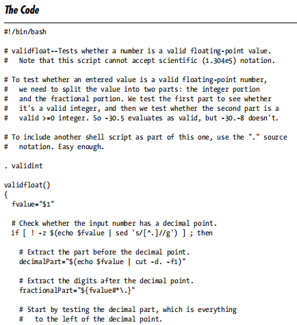
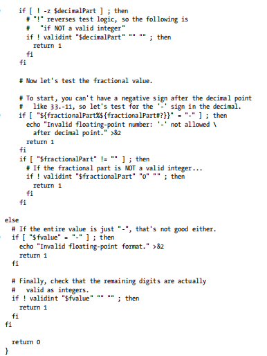
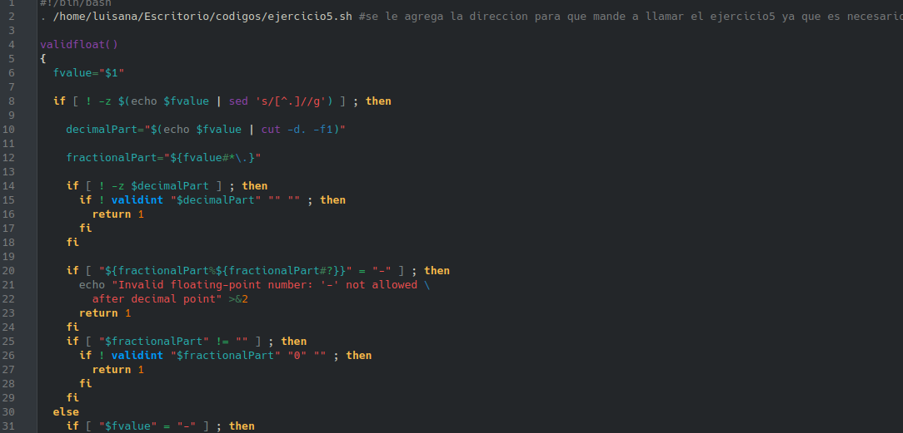
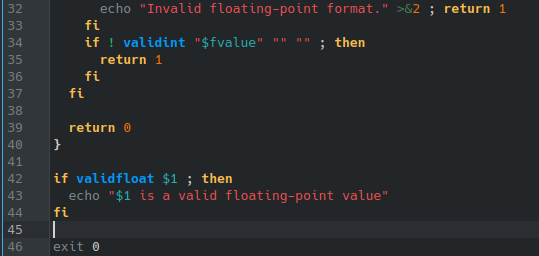
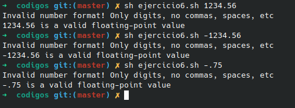

# **CODIGO 6 VALIDAR UN NUMERO**
 
Su función es mostrarle a el usuario si el numero es un numero flotante 
 

## Codigo 6 SIN CORRECIONES : 

 
Para que este codigo funcione se requiere del codigo 5 y sin el no funciona 
 

## Codigo 6 CON CORRECIONES: 

### **EJECUCION DEL CODIGO**

[INICIO](https://github.com/SPM-UPVictoria/test-git-2130074/tree/main/codigos)
