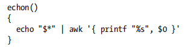
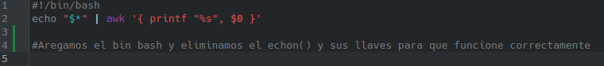
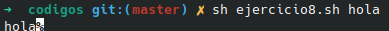

# **CODIGO 8 **
Se trata de un codigo en donde se agrega "%" al final 

## Codigo 8 SIN CORRECIONES : 

 
Se eliminaron las llaves para una mejor ejecucion y se remplazo el echon() por un #/bin/bash 
 

## Codigo 8 CON CORRECIONES: 

### **EJECUCION DEL CODIGO**
