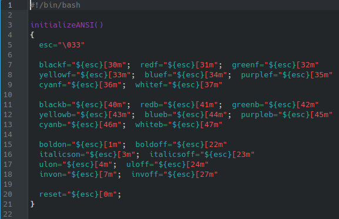

# **CODIGO 11 **
Nos muestra el codigo con algo de color aun estando en consola 

## Codigo 11 

 
**[<- Reggresar al inicio](https://github.com/SPM-UPVictoria/test-git-2130074/blob/main/README.md)**
