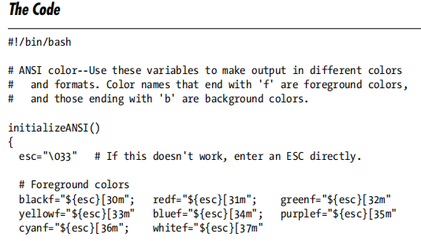
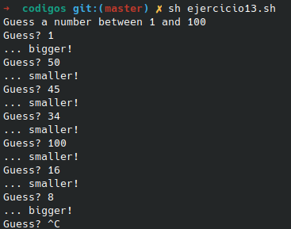

# **CODIGO 13**
 
Algo debo admitir es mi codigo favorito del momento se trata de un codigo en el cual te dice si el numero es grande o pequeño y se sale de el con ctrl+c 
 

## Codigo 13 : 

 

### **EJECUCION DEL CODIGO**

