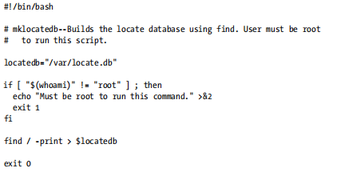
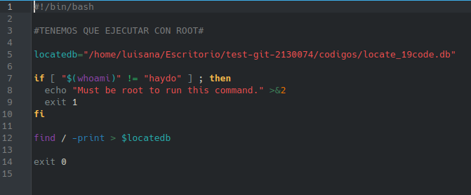

# **CODIGO 19**
 
Requiere de otro codigo para funcionar correctamente y para correrlo sin problemas se debe usar tambien root 
 

## Codigo 19 SIN CORRECIONES : 

 

## Codigo 19 CON CORRECIONES: 

[INICIO](https://github.com/SPM-UPVictoria/test-git-2130074/tree/main/README.md)
