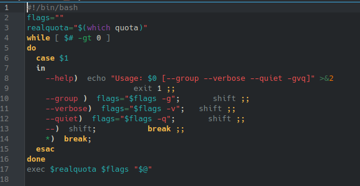

# **CODIGO 30**
 
El comando quota muestra nuevas flags
 
IMPORTANTE: Tiene que estar instalado el comando quota-tools para poderse ejecutar
 

## Codigo 30 : 

[INICIO](https://github.com/SPM-UPVictoria/test-git-2130074/tree/main/README.md)