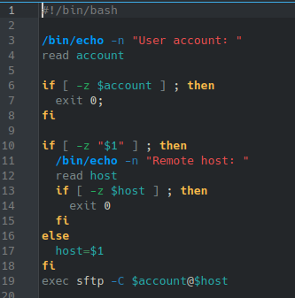

# **CODIGO 31 **
Tiene la funcion de hacer que el comando sftp se vuelva mas comodo
## Codigo 31

 

### **EJECUCION DEL CODIGO**

[INICIO](https://github.com/SPM-UPVictoria/test-git-2130074/tree/main/README.md)