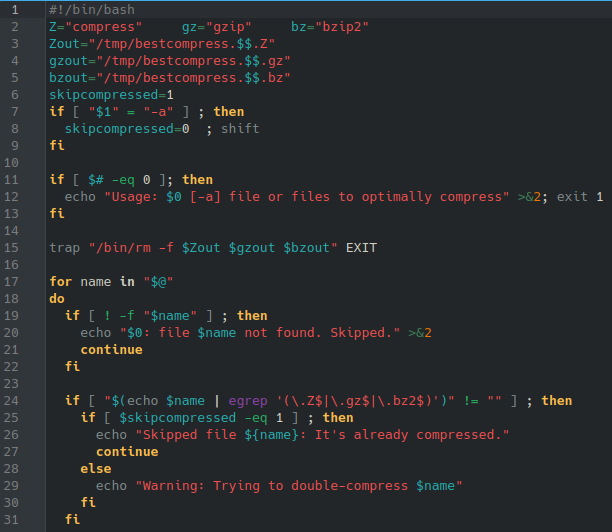
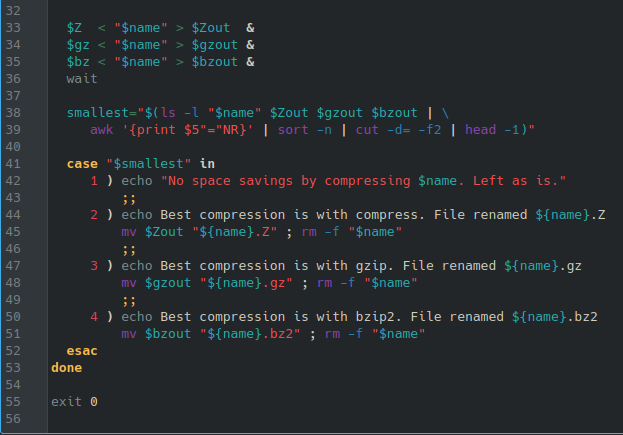
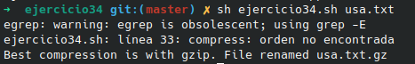

# **CODIGO 34**
Se trata de un codigo en donde se agrega "%" al final 

## Codigo 34 : 

### **EJECUCION DEL CODIGO**

[INICIO](https://github.com/SPM-UPVictoria/test-git-2130074/tree/main/README.md)
