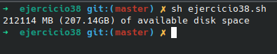

# **CODIGO 38**
 
Su función es mostrar el espacio total en GB del equipo en uso
 

## Codigo 38

 

### **EJECUCION DEL CODIGO**

[INICIO](https://github.com/SPM-UPVictoria/test-git-2130074/tree/main/README.md)