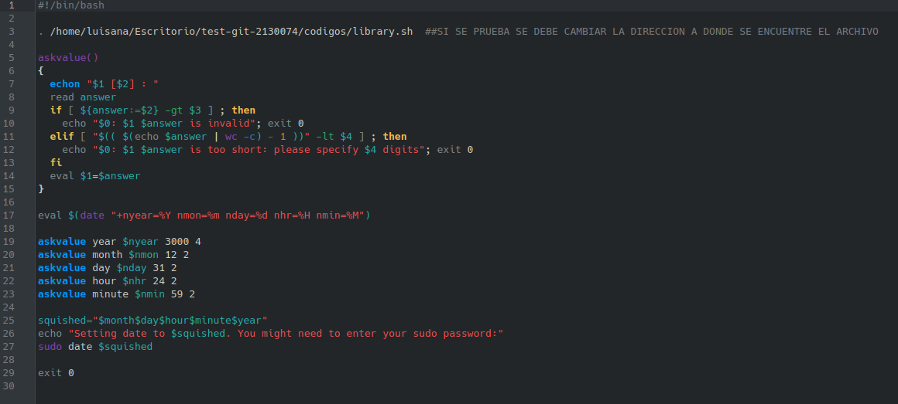

# **CODIGO 46**
 
Su funcion es cambiar la fecha de la computadora en base a los inputs del usuario
 

## Codigo 46

**[<- Reggresar al inicio](https://github.com/SPM-UPVictoria/test-git-2130074/blob/main/README.md)**