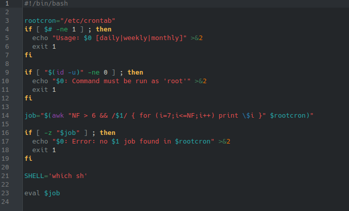

# **CODIGO 49**
 
Su funcion es: Buscar en la carpeta Crontab para ver si tiene algo que hacer diario, semanal o mensual 
 

## Codigo 49 

**[<- Reggresar al inicio](https://github.com/SPM-UPVictoria/test-git-2130074/blob/main/README.md)**