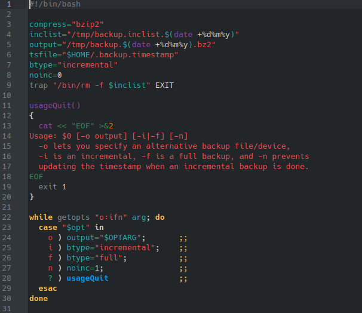
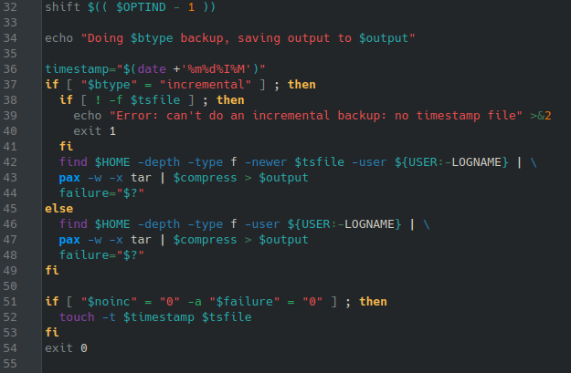
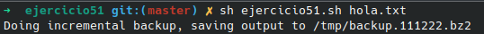

# **CODIGO 51**
 
Su función es generar un Backup en un archivo.zip de un directorio
 

## Codigo 51

### **EJECUCION DEL CODIGO**

[INICIO](https://github.com/SPM-UPVictoria/test-git-2130074/tree/main/README.md)