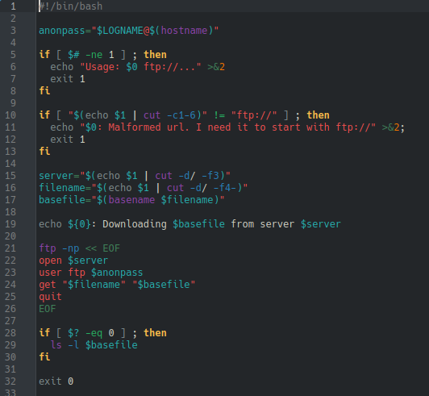

# **CODIGO 53**
 
Su funcion es: Descargar un archivo FTP mediante codigo pero para que funcione se requiere  el paquete inetutils para el comando ftp
 
Instalar inetuils en ArchLinux: sudo pacman -S inetutils
 

## Codigo 53

**[<- Reggresar al inicio](https://github.com/SPM-UPVictoria/test-git-2130074/blob/main/README.md)**