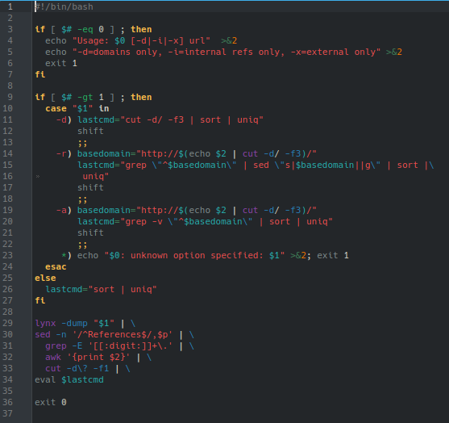

# **CODIGO 54**
 
Su funcion es: Obtiener los subenlaces de una pagina web dada pero este requiere estar conectado a internet
 

## Codigo 54 

**[INICIO](https://github.com/SPM-UPVictoria/test-git-2130074/blob/main/README.md)**
