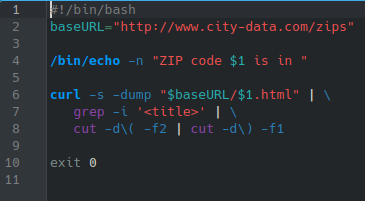
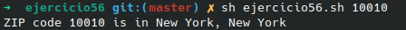

# **CODIGO 56**
 
Su funcion es: Dado un codigo "ZIP" o postal de Estados Unidos nos mostrara a donde pertenece
 

## Codigo 56

### **EJECUCION DEL CODIGO**

**[INICIO](https://github.com/SPM-UPVictoria/test-git-2130074/blob/main/README.md)**
