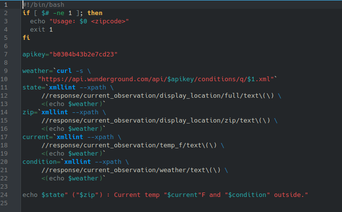
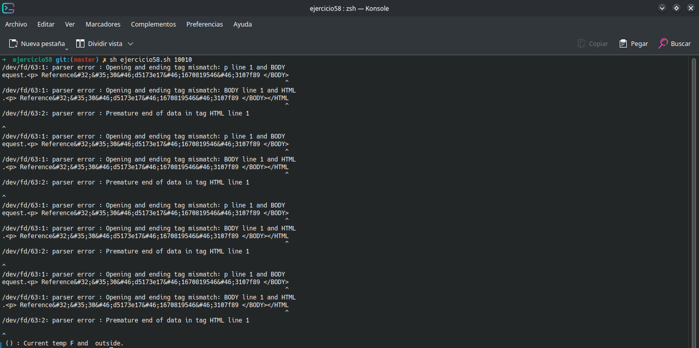

# **CODIGO 58**
 
Su función es: Muestrar el clima de un codigo postal dado
 

## Codigo 58

### **EJECUCION DEL CODIGO**

[INICIO](https://github.com/SPM-UPVictoria/test-git-2130074/tree/main/README.md)