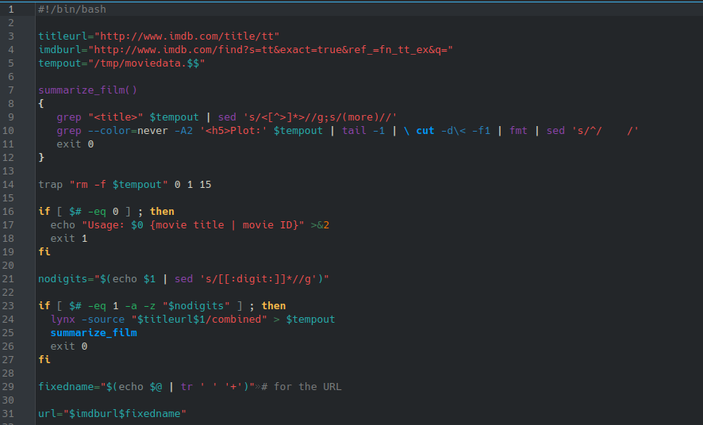
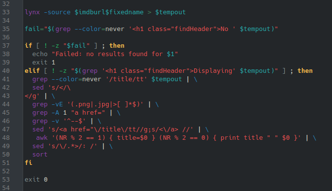

# **CODIGO 59**
 
Su función es: Dado el nombre de una pelicula, la muestra con la descriptcion de la pagina IMDB
 

## Codigo 59

[INICIO](https://github.com/SPM-UPVictoria/test-git-2130074/tree/main/README.md)