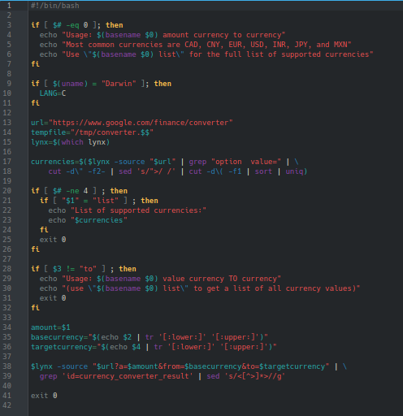

# **CODIGO 60**
 
Su funcion es: Hace un cambio de monedas entre las mas comunes.Sin embargo, la pagina que realizaba esto dejo de exixtir, asi que no se puede ejecutar
 

## Codigo 60

**[<- Reggresar al inicio](https://github.com/SPM-UPVictoria/test-git-2130074/blob/main/README.md)**