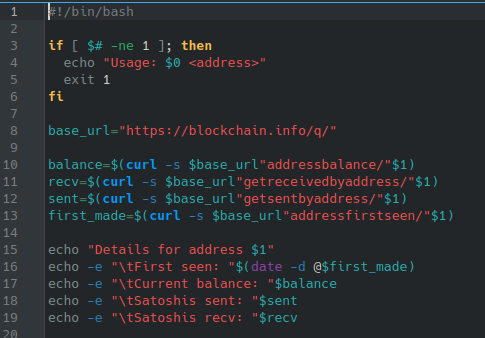
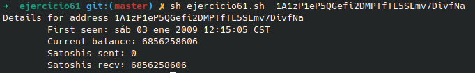

# **CODIGO 61**
 
Su función es: Muestrar detalles de una direccion BTC para ejecutarlo necesitamos de conexion a internet

 

## Codigo 61

### **EJECUCION DEL CODIGO**

[INICIO](https://github.com/SPM-UPVictoria/test-git-2130074/tree/main/README.md)