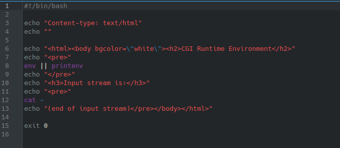
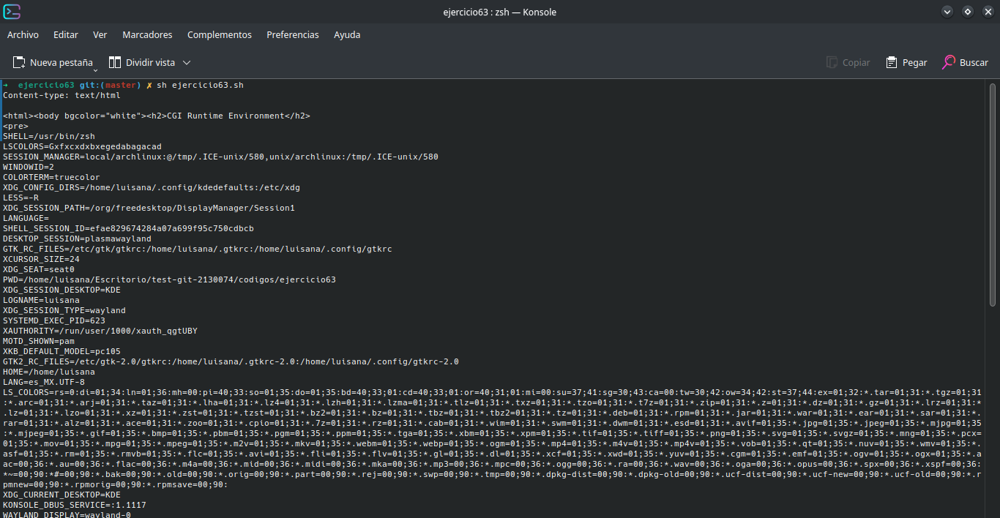

# **CODIGO 63**
 
Su funcion es imprimir el entorno de desarrollo en formato HTML y ademas funciona correctamente sin la necesidad de un arreglo 
 

## Codigo 63

### **EJECUCION DEL CODIGO**

[INICIO](https://github.com/SPM-UPVictoria/test-git-2130074/tree/main/README.md)
