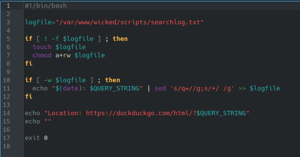

# **CODIGO 64**
 
Su funcion es: Generar un pequeño buscador por lo que requiere de internet
 

## Codigo 64 

**[<- Reggresar al inicio](https://github.com/SPM-UPVictoria/test-git-2130074/blob/main/README.md)**