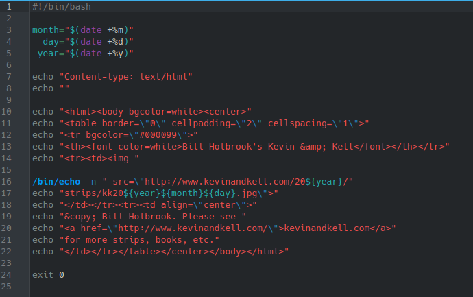
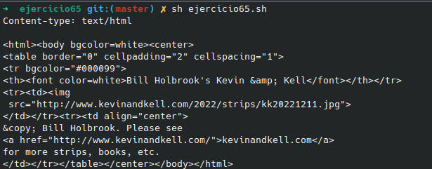

# **CODIGO 65**
 
Su función es crear un codigo HTML con una tira comica de Kevin&Kell ademas funciono directamente 
 

## Codigo 65

### **EJECUCION DEL CODIGO**

[INICIO](https://github.com/SPM-UPVictoria/test-git-2130074/tree/main/README.md)