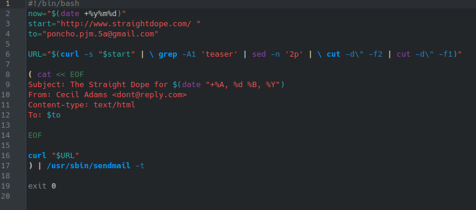
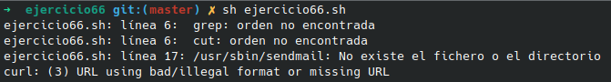

# **CODIGO 66**
 
Su función es enviar una pagina web por medio de correo electronico

 

## Codigo 66

### **EJECUCION DEL CODIGO**

[INICIO](https://github.com/SPM-UPVictoria/test-git-2130074/tree/main/README.md)