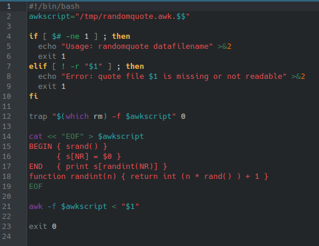
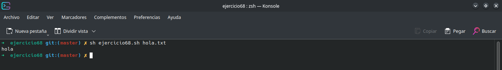

# **CODIGO 68**
 
Su función es tomar una frase de un archivo txt y afortunadamente funciona correctamente sin necesidad de correciones 

 

## Codigo 68

### **EJECUCION DEL CODIGO**

[INICIO](https://github.com/SPM-UPVictoria/test-git-2130074/tree/main/README.md)