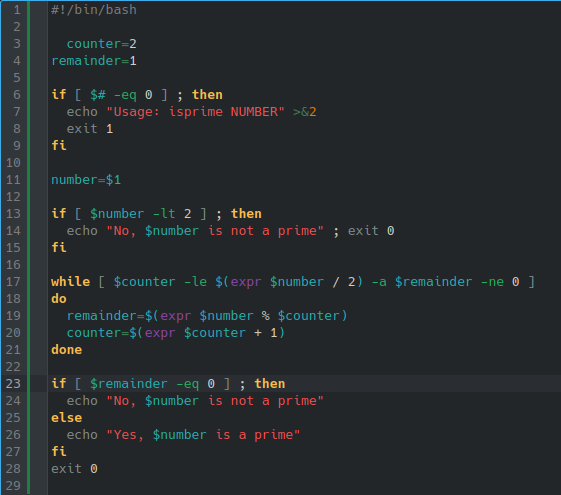

# **CODIGO 86**
 
Su funcion es indicar si un numero es primo o no. Ademas este no se tuvo que modificar ya que funcionaba correctamente 
 

## Codigo 86

[INICIO](https://github.com/SPM-UPVictoria/test-git-2130074/tree/main/README.md)