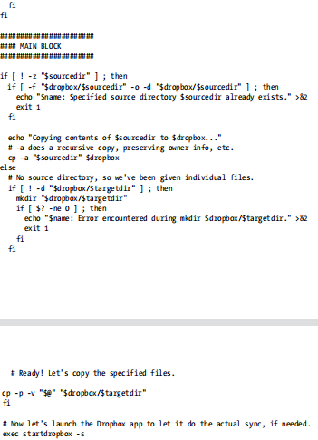
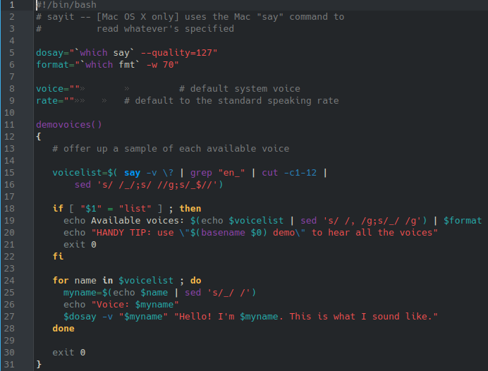

# **CODIGO 93**
 
Su funcion es utilizar el speak para reproducir algo
 

## Codigo 93 SIN CORRECIONES : 

 
Se debio cambiar lo que tiene que ver con el comando say por el comando speak-ng para que funcione correctamente
 

## Codigo 93 CON CORRECIONES: 

[INICIO](https://github.com/SPM-UPVictoria/test-git-2130074/tree/main/README.md)