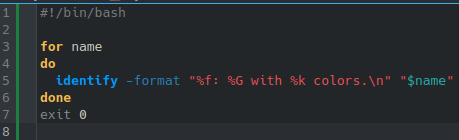
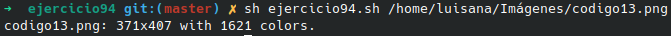

# **CODIGO 94**
 
Su función es mostrar caracteristicas de una imagen dada afortunadamente funciono correctamente y no habia que hacerle arreglos
 

## Codigo 94

### **EJECUCION DEL CODIGO**

[INICIO](https://github.com/SPM-UPVictoria/test-git-2130074/tree/main/README.md)